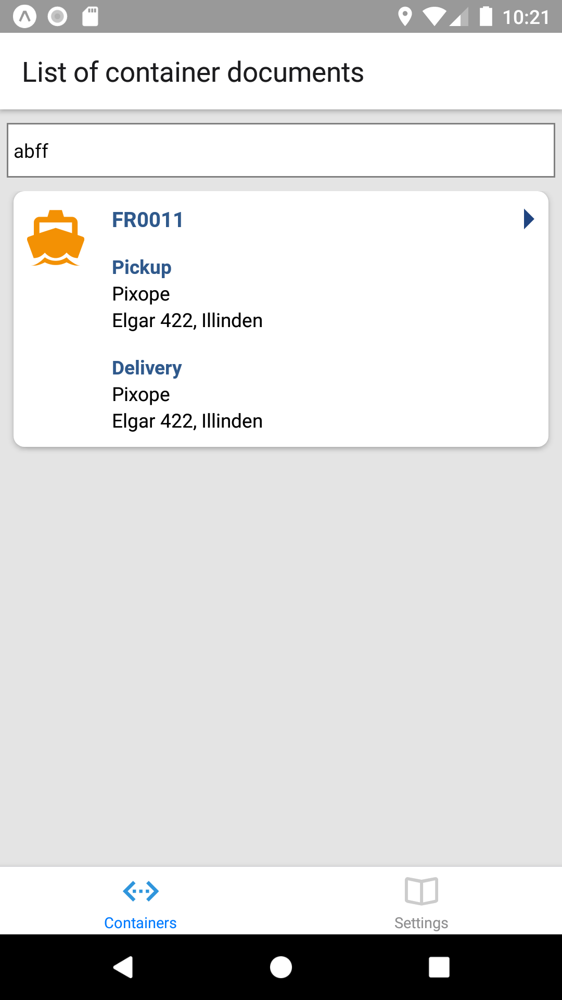

# Where is my container app

An app to track the current location of your intermodal container. It facilitates easy communication between the owner and the transporter of any container. 

The basic workflow is that the owner of a container creates a Container Tracking. The container tracking is shared with the transporter using a  secret code which is sent through their existing communication channel (email, whatsapp, etc).

The transporter will then enter the secret code in the app and use it to notify the container owner when some significant event occurs related to the container. These events include picking up the container from the port or dropping it off at the destination.

Architecturally it uses AWS Amplify for storing the container trackings and React Native for implementing the app.

Features:

- create a tracking as a container owner
- lookup a container tracking as a transporter <- done
- register significant events
- GPS coordinates in significant events

# Development

Start an emulator or connect a phone and run the following command:

    yarn run

For working on the backend install Amplify cli and run

    amplify push

# Screenshots

 
